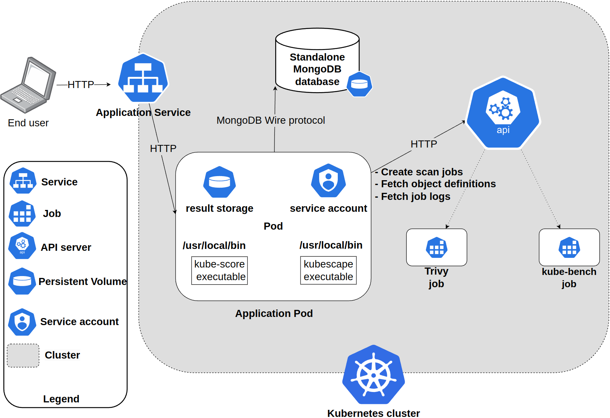
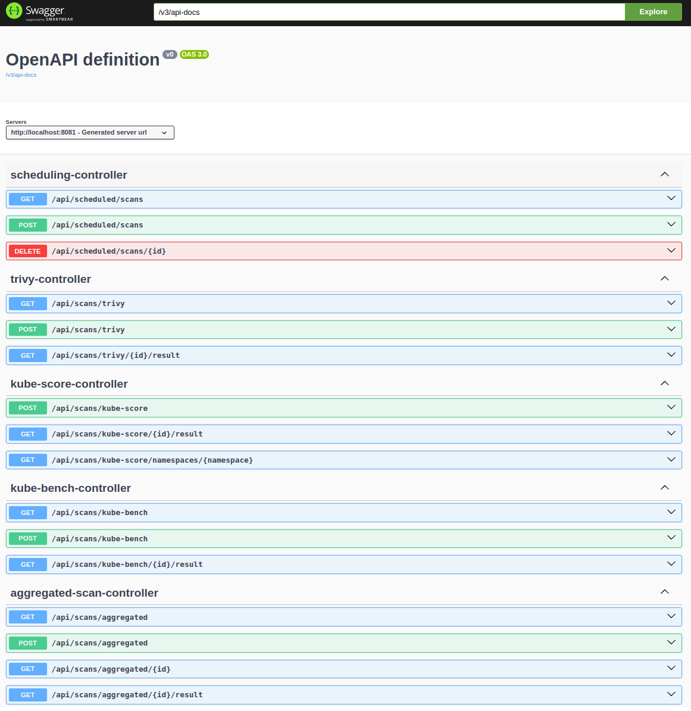
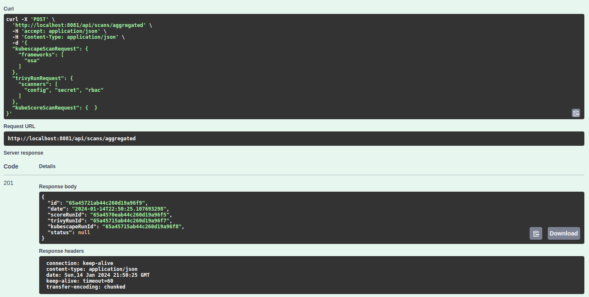
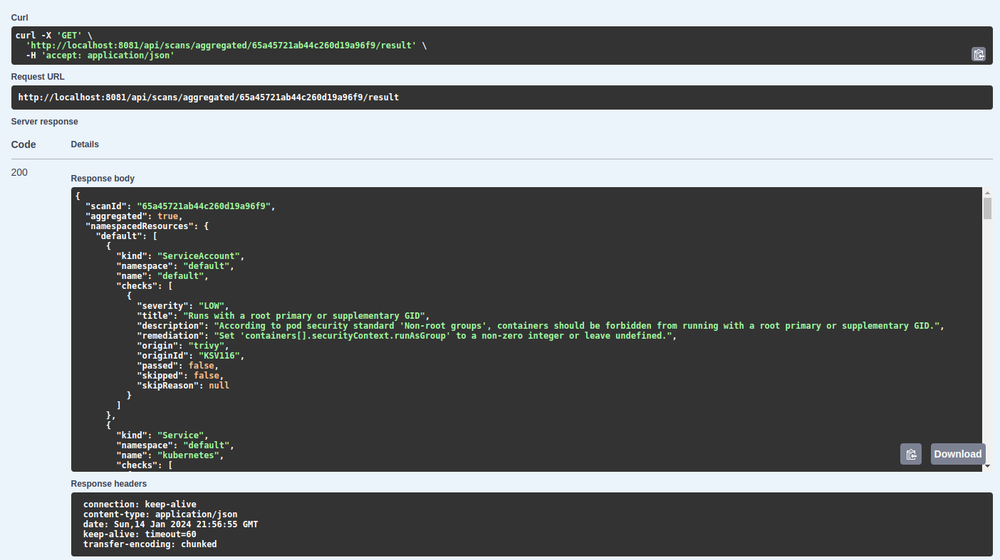

<!--- app-name: kube-security-scanner -->

# kube-security-scanner

`kube-security-scanner` is a tool for security scan automation and analysis.

### Main system functionalities
* Running security scans using four different open-source tools through via one API.
  * each tool provides different ways of running e.g., using a CLI from an executable on a remote machine, an in-cluster job (kube-bench) or a Kubernetes Operator (trivy, kubescape), hence less components to maintain
  * the scans pertain to configuration, vulnerabilities, (e.g., in container images), RBAC, exposed secrets within the Kubernetes cluster resources
  * the scans are performed on resource definitions queried from the Kubernetes API server
* Automation and scheduling of scans
  * scans can be triggered either using a HTTP endpoint or a scheduler based on CRON expressions
* Persistence of scan results and metadata
  * in most tools, scan results are ephemeral (short-lived), as they are for instance stored as logs of the Pod that ran the related job, hence the persisted results can be used for compliance auditing or trend analysis
* Unified data format for scan results
  * although all the utilized scanning tools serve a similar purpose, the data format from one to another can be very different
    * some formats are very verbose (e.g., kubescape or trivy scans of a "fresh" GKE cluster can result in an over 100k lines JSON)
* Result aggregation
  * based on the unified data format, scan results from different tools can be aggregated, i.e., all the checks relating to a given Kubernetes resource are clustered together, creating a coherent result from various sources
* Result filtering
  * thanks to the unified data format, results can be filtered based on various resource features like namespace, kind, and name, or based on given check's severity and origin (origin means from which tool given check is and what identifier it has in this tool as it is preserved in the mapping)
  * this capability is not possible in the original tools themselves (or only to the minimal extent of filtering by namespace only)
* Framework compliance scoring by namespace
  * although compliance scoring is nothing new (trivy has 4 frameworks built-in, kubescape has 9), none of the tools can give a per namespace score which can be especially helpful for instance in multi-tenancy scenarios, where each tenant (developer team or customer) uses a single namespace,
  * the tool computes various metrics based on kubescape scans (as it is the only tool that when performing a compliance scan returns check information for each resource), such as:
    * failed and passed resources per namespace and globally (a failed resource means a Kubernetes resource that has at least one check failed against it)
    * failed and passed checks per namespace and globally (check refers to a test/control performed by the scanner, each framework has a defined set of checks)
    * per namespace score: number of passed checks in a namespace / all checks in that namespace
    * global score: average of all namespace scores
* CSV support
  * both the compliance scan results and the results in the unified data format can be exported in CSV format (additional to JSON) which allows further analysis

### System architecture

The tool runs as a process inside a container of a Kubernetes Pod. The communication with the tool is possible using HTTP protocol and an exposed REST API.
The tool communicates with the cluster API server to:
* fetch resource definitions for scans
* create jobs related to scans
* fetch job logs (scan results)

The persistence layer is provided by an in-cluster NoSQL MongoDB database (for scan metadata and scheduled runs information) and by a Persistent Volume mounted inside a Pod (for raw result storage).
Results from both kubescape and kube-score are written instantly after the scan to the aforementioned Persistent Volume.
Two less resource-consuming scanners are ran as an executable mounted in the container image filesystem (kubescape and kube-score). The more resource-extensive trivy and kube-bench which requires a specific set of volume mounts to perform checks on the host are ran as a Kubernetes job inside the cluster.
Results from the job-based scans are pulled every minute and if present saved in the same Persistent Volume as previously.

### Example usage
For documentation purposes, as well as ease of use, the tool exposes an OpenAPI v3 specification, along with Swagger UI.
The UI is exposed at path `/swagger-ui/index.html` and the API documentation at `v3/api-docs`.

Below is an example of launching an aggregated scan using a POST request.

The response data points to the ids of every scan from the aggregation, as well as the id of the aggregated scan entity itself.
The result can be fetched using a corresponding GET request.

When the accept HTTP header has a value of `text/csv`, the result is downloaded in CSV format instead of JSON. Below is an example of an aggregated result CSV response converted into a table. Non-namespaced resources have the first column empty.

|namespace  |kind                          |name                                                      |low|medium|high|critical|
|-----------|------------------------------|----------------------------------------------------------|---|------|----|--------|
|gmp-system |ServiceAccount                |operator                                                  |0  |2     |1   |0       |
|gmp-system |ServiceAccount                |operator                                                  |0  |1     |1   |0       |
|gmp-system |ServiceAccount                |operator                                                  |0  |1     |1   |0       |
|gmp-system |ServiceAccount                |operator                                                  |0  |2     |1   |0       |
|gmp-system |ServiceAccount                |operator                                                  |0  |1     |0   |0       |
|gmp-system |ServiceAccount                |collector                                                 |0  |1     |0   |0       |
|kube-system|DaemonSet                     |nvidia-gpu-device-plugin-small-ubuntu                     |0  |0     |3   |0       |
|kube-system|DaemonSet                     |tpu-device-plugin                                         |0  |0     |3   |0       |
|kube-system|ConfigMap                     |gke-metrics-agent-conf                                    |0  |0     |1   |0       |
|kube-system|DaemonSet                     |nvidia-gpu-device-plugin-small-cos                        |0  |0     |3   |0       |
|kube-system|ServiceAccount                |pkgextract-cleanup-service                                |0  |1     |0   |0       |
|kube-system|ServiceAccount                |pkgextract-service                                        |0  |1     |0   |0       |
|kube-system|DaemonSet                     |nvidia-gpu-device-plugin-large-ubuntu                     |0  |0     |3   |0       |
|kube-system|DaemonSet                     |nvidia-gpu-device-plugin-large-cos                        |0  |0     |3   |0       |
|kube-system|ServiceAccount                |cilium-win                                                |0  |1     |0   |0       |
|kube-system|DaemonSet                     |runsc-metric-server                                       |0  |0     |2   |0       |
|kube-system|DaemonSet                     |nvidia-gpu-device-plugin-medium-cos                       |0  |0     |3   |0       |
|kube-system|DaemonSet                     |nvidia-gpu-device-plugin-medium-ubuntu                    |0  |0     |3   |0       |
|           |Namespace                     |kubescape                                                 |0  |1     |0   |0       |
|           |Namespace                     |gmp-public                                                |0  |1     |0   |0       |
|           |ValidatingWebhookConfiguration|gmp-operator.gmp-system.monitoring.googleapis.com         |1  |0     |0   |0       |
|           |Namespace                     |kcs                                                       |0  |1     |0   |0       |
|           |MutatingWebhookConfiguration  |warden-mutating.config.common-webhooks.networking.gke.io  |0  |1     |0   |0       |
|           |MutatingWebhookConfiguration  |gmp-operator.gmp-system.monitoring.googleapis.com         |0  |1     |0   |0       |
|           |ValidatingWebhookConfiguration|warden-validating.config.common-webhooks.networking.gke.io|1  |0     |0   |0       |
|           |User                          |system:cloud-controller-manager                           |0  |1     |1   |0       |
|           |Namespace                     |gmp-system                                                |0  |1     |0   |0       |

For contrast, below is an example of an NSA compliance summary per namespace and globally (the last row with first column empty)

|namespace  |failedChecks                  |passedChecks                                              |failedResources|passedResources|score|
|-----------|------------------------------|----------------------------------------------------------|---------------|---------------|-----|
|default    |0                             |2                                                         |0              |2              |100.0|
|gmp-public |1                             |1                                                         |1              |1              |50.0 |
|kube-node-lease|0                             |2                                                         |0              |2              |100.0|
|gmp-system |4                             |11                                                        |7              |11             |76.19047619047619|
|kube-system|12                            |3                                                         |13             |171            |87.05691786283893|
|kube-public|0                             |2                                                         |0              |2              |100.0|
|           |12                            |3                                                         |30             |248            |83.36895407717826|


### Installing the Chart

To install the chart with the release name `my-release`:

```console
helm install my-release ./kcs -f ./kcs/values.yaml -n <my-namespace> --create-namespace
```

These commands deploy kube-security-scanner on the Kubernetes cluster in the default configuration.
The [Parameters](#parameters) section lists the parameters that can be configured during installation.

### Uninstalling the Chart

To uninstall/delete the `my-release` deployment:

```console
helm delete my-release
```

The command removes all the Kubernetes components associated with the chart and deletes the release.

### Parameters

### Common parameters

| Name               | Description                                            | Value                               |
|--------------------|--------------------------------------------------------|-------------------------------------|
| `image.repository` | The repository of app container image                  | `"kamieniarzk/kube-security-scanner"` |
| `image.tag`        | App container image tag                                | `"latest"`                          |
| `storage.results`  | Size of persistent storage for in-cluster scan results | `"1Gi"`                             |
| `storage.mongo`    | In-cluster MongoDB database size                       | `"1Gi"`                             |
| `clusterName`      | Cluster name for context                               | `your-cluster-name`                 |


Either put the parameters inside `values.yaml`

```console
helm install my-release -f ./kcs/values.yaml ./kcs
```

or specify each parameter using the `--set key=value[,key=value]` argument to `helm install`. For example,

```console
helm install my-release \
               --set storage.results=2Gi \
               --set storage.mongo=512Mi \
               --set clusterName="my-rke-cluster" \
               ./kcs
```
> **Tip**: You can use the default [values.yaml](helm/kcs/values.yaml)


### Known limitations
* Aggregated scan status is not handled properly yet - one has to either query individual APIs for status or just query for the whole result until it is ready
* Some checks are skipped because of their requirements and nature (such as the checks for control plane on cloud provider clusters, where we can not schedule workloads on the control plane)
* Due to the nature of scan based jobs that additionally take a long time, the scans are ran asynchronously, i.e., the client has to fetch the result separately as it would take too long


### TODO
* ~~Make the service-account related to in-cluster app deployment have permissions to execute necessary actions~~
* ~~Check how kube-score can be used~~
* ~~Embed kube-score binary within app docker image~~
* ~~Use MongoDB to persist scan related data~~
* ~~Use ephemeral pod storage (emptyDir) to store YAML manifests for kube-score~~
* ~~Use PVC to persist logs from scan runs~~
  * ~~make compatible local-dev configuration~~
* ~~(nice to have): configure GitHub workflow to build and push docker image~~
* ~~Implement kube-score service layer~~
  * ~~take resource name and namespace~~
  * ~~run kube-score binary on that resource yaml stored on temp PV~~
  * ~~save kube-score output along with other logs (perhaps use distinct location)~~
* ~~Refactor service and persistence layer - introduce distinct interfaces for each type of scans (hunter, score, bench)~~
* ~~Initialize kube-hunter interface~~
  * ~~one persistence layer for JobRuns (id, date, podName)~~
  * ~~separate persistence layers for each kube-bench and kube-hunter (both job based tasks)~~
* ~~Init context aware analysis~~
  * ~~parse kube-hunter json to object~~
  * ~~parse kube-bench to some object structure~~
  * ~~parse kube-score to some object structure~~
* ~~Create helm chart~~
  * ~~create templates from objects in `k8s` dir~~
  * ~~create Values.yaml~~
  * ~~create variable identifying cluster in `Values.yaml`~~
* ~~Cluster context~~
  * ~~recognize cluster type (for different kube-bench config and possibly other things too)~~
  * ~~set `clusterId` variable (from value passed by `Values.yaml`, if not present fallback to some value based on runtime, e.g. node name or api server url)~~
  * save `clusterId` in all persisted runs
* ~~Involve trivy scans~~
  * ~~make kube-score run through same set of resources as trivy -all scan~~
  * ~~persist trivy runs~~
  * ~~parse trivy results~~
* ~~Implement scheduling~~
  * ~~generic mechanism for CRON-based scheduling~~
  * ~~persist cron definitions (along with run spec)~~
* ~~Aggregate results~~
  * ~~aggregate kube-score results by namespace~~
  * ~~create a generic structure~~
* ~~(Optional) introduce database per cluster option~~
  * ~~local (in-cluster) MongoDB instance~~
  * cluster context perhaps obsolete then?
* Result API
  * ~~unified workload scan result structure and mapping from trivy and kube-score models~~
  * unified compliance scan structure and mapping from kube-bench (CIS) and trivy (NSA and PSS)
  * ~~JSON and CSV/XLSX response format for summary endpoints~~
* ~~Filter API~~
  * ~~filtering of results based on namespace, kind, name, severity, and check origin~~
* (Optional) hexagonal architecture
  * separate domain and infrastructure (at least at package-level)
  * java-based configuration (avoid spring annotations for class initialization)
  * extract the abstraction related to job-based scans


### References
* [kube-bench](https://github.com/aquasecurity/kube-bench)
* [kube-score](https://github.com/zegl/kube-score)
* [trivy](https://github.com/aquasecurity/trivy)
* [kubescape](https://github.com/kubescape/kubescape)
