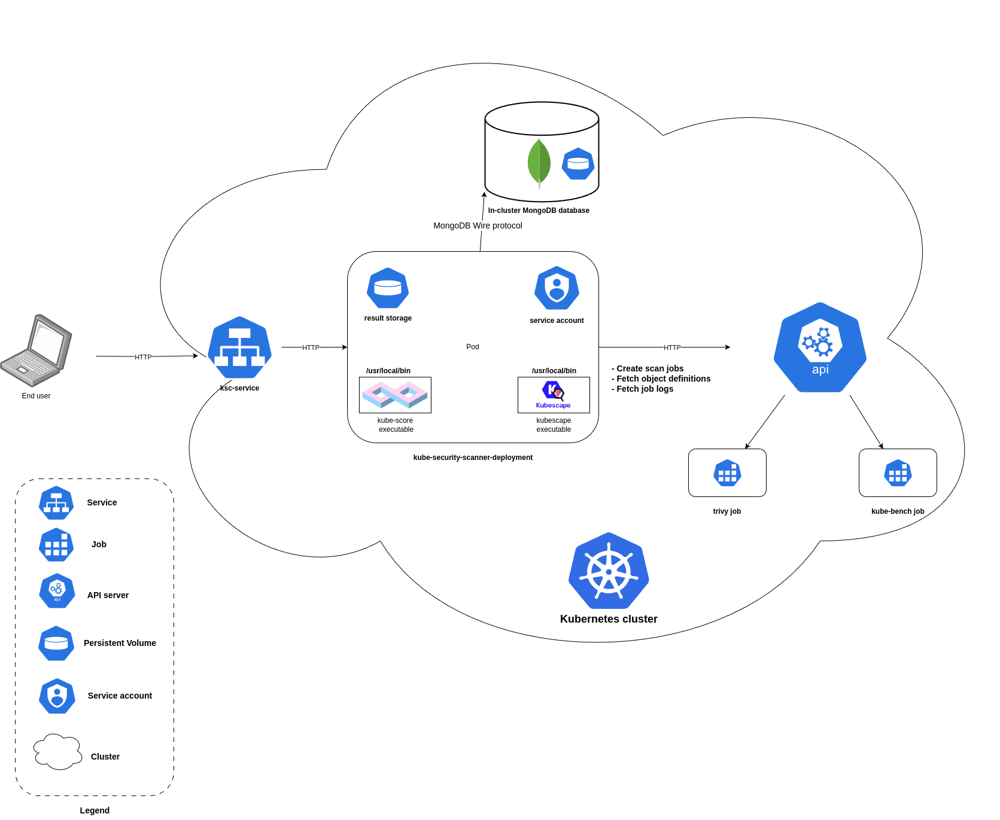

### Main system functionalities
* Running security scans using four different open-source tools through via one API.
  * each tool provides different ways of running e.g., using a CLI from an executable on a remote machine, an in-cluster job (kube-bench) or a Kubernetes Operator (trivy, kubescape), hence less components to maintain
  * the scans pertain to configuration, vulnerabilities, (e.g., in container images), RBAC, exposed secrets within the Kubernetes cluster resources
  * the scans are performed on resource definitions queried from the Kubernetes API server
* Automation and scheduling of scans
  * scans can be triggered either using a HTTP endpoint or a scheduler based on CRON expressions
* Persistence of scan results and metadata
  * in most tools, scan results are ephemeral (short-lived), as they are for instance stored as logs of the Pod that ran the related job, hence the persisted results can be used for compliance auditing or trend analysis
* Unified data format for scan results
  * although all the utilized scanning tools serve a similar purpose, the data format from one to another can be very different
    * some formats are very verbose (e.g., kubescape or trivy scans of a "fresh" GKE cluster can result in an over 100k lines JSON)
* Result aggregation
  * based on the unified data format, scan results from different tools can be aggregated, i.e., all the checks relating to a given Kubernetes resource are clustered together, creating a coherent result from various sources
* Result filtering
  * thanks to the unified data format, results can be filtered based on various resource features like namespace, kind, and name, or based on given check's severity and origin (origin means from which tool given check is and what identifier it has in this tool as it is preserved in the mapping)
  * this capability is not possible in the original tools themselves (or only to the minimal extent of filtering by namespace only)
* Framework compliance scoring by namespace
  * although compliance scoring is nothing new (trivy has 4 frameworks built-in, kubescape has 9), none of the tools can give a per namespace score which can be especially helpful for instance in multi-tenancy scenarios, where each tenant (developer team or customer) uses a single namespace,
  * the tool computes various metrics based on kubescape scans (as it is the only tool that when performing a compliance scan returns check information for each resource), such as:
    * failed and passed resources per namespace and globally (a failed resource means a Kubernetes resource that has at least one check failed against it)
    * failed and passed checks per namespace and globally (check refers to a test/control performed by the scanner, each framework has a defined set of checks)
    * per namespace score: number of passed checks in a namespace / all checks in that namespace
    * global score: average of all namespace scores
* CSV support
  * both the compliance scan results and the results in the unified data format can be exported in CSV format (additional to JSON) which allows further analysis

### System architecture

The tool runs as a process inside a container of a Kubernetes Pod. The communication with the tool is possible using HTTP protocol and an exposed REST API.
The tool communicates with the cluster API server to:
* fetch resource definitions for scans
* create jobs related to scans
* fetch job logs (scan results)

The persistence layer is provided by an in-cluster NoSQL MongoDB database (for scan metadata and scheduled runs information) and by a Persistent Volume mounted inside a Pod (for raw result storage).
Results from both kubescape and kube-score are written instantly after the scan to the aforementioned Persistent Volume.
Two less resource-consuming scanners are ran as an executable mounted in the container image filesystem (kubescape and kube-score). The more resource-extensive trivy and kube-bench which requires a specific set of volume mounts to perform checks on the host are ran as a Kubernetes job inside the cluster.
Results from the job-based scans are pulled every minute and if present saved in the same Persistent Volume as previously.
### Installation
The system can be installed via Helm which is a package manager for Kubernetes that includes all the necessary code and resources needed to deploy an application to a cluster.
